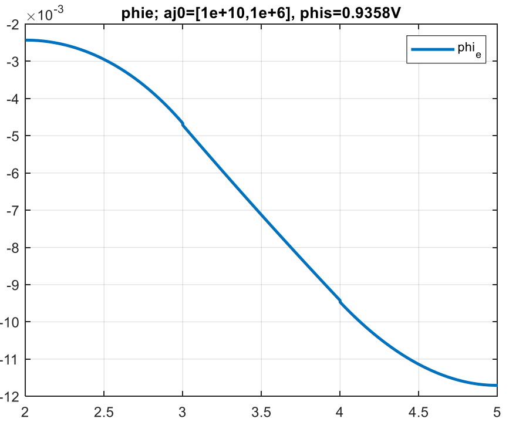
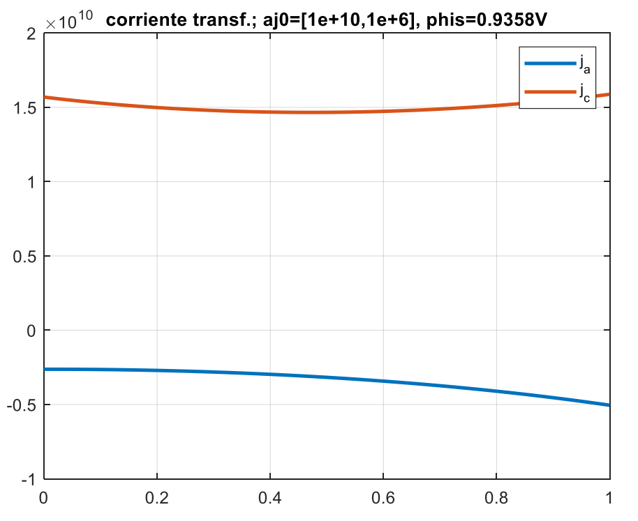

# ⚡ 1D PEM Fuel Cell Simulation Using Finite Difference Methods  
**Capstone Project** of my **Bachelor** in **Mechanical Engineering** at **UC Berkeley**  
**Contributor:** Esteban Labrador  
**Advisors:** Jaime Carpio, Pedro Galán  
**Date:** September 2022 – July 2023  
**Tools Used:** MATLAB, Numerical Modeling, Finite Difference Method  

---

## 🌍 Project Objective  
Hydrogen fuel cells are vital for the clean energy transition, but optimizing their performance requires detailed understanding of complex internal processes. This project develops a **1D Finite Difference Simulation** of a **Proton Exchange Membrane Fuel Cell (PEMFC)** capturing the transport of gases, heat, and electric charge across a multilayer structure including membrane, catalyst layers, diffusion layers, and gas channels.

The model incorporates nonlinear source terms related to electrochemical reactions, making the system highly complex and challenging to solve. The simulation enables analysis of how design parameters and operating conditions impact overall fuel cell efficiency and stability.

---

## ⚙️ Technical Overview  
- **Layers Modeled:** Membrane, catalyst layers, diffusion layers, gas channels (7 layers total)  
- **Equations Solved:** Conservation of mass, momentum, energy, species (H₂, O₂, H₂O, protons), and charge  
- **Numerical Approach:** Finite difference discretization with nonlinear source terms  
- **Challenges:** Strong nonlinearities in species and charge conservation equations requiring iterative solvers for convergence  

  

  <em>Schematic of a proton exchange membrane fuel cell (PEMFC)</em>

The electrochemical reactions that occur in the catalytic layers, at the anode and cathode respectively, are as follows:

**Anode (oxidation):**

$$
\mathrm{H_2 \rightarrow\ 2H^+ + 2e^-}
$$

**Cathode (reduction):**

$$
\mathrm{\tfrac{1}{2}O_2 + 2H^+ + 2e^- \rightarrow\ H_2O}
$$

**Overall reaction:**

$$
\mathrm{H_2 + \tfrac{1}{2}O_2 \rightarrow\ H_2O}
$$

**The system of equations used to model the PEMFC is:**

**1. Species Conservation Equation**

The conservation equation for species is given by:

$$
\frac{\partial X_k}{\partial t} = D_k \frac{\partial^2 X_k}{\partial x^2} + S_k
$$

The species considered in the model are:  **H₂, H⁺, O₂, and H₂O**.  

The equation for each species is applied **only in the layers where that species is present**.

**2. Charge Conservation Equation**

The charge conservation equation is expressed as:

$$
\frac{\partial}{\partial x} \left( \sigma_e \frac{\partial \Phi_e}{\partial x} \right) + S_{\Phi} = 0
$$

This equation is applicable **only to the catalytic layers and the membrane**.

The dimensionless source terms are expressed as shown in the next table.

| Layer Type                 | $S_k$                                                                                                  | $S_{\Phi}$                                |
|---------------------------|---------------------------------------------------------------------------------------------------------------|----------------------------------------------|
| **Anodic catalytic layer** | $\dfrac{\delta_{\text{anode}}^2 cr_{k,a} j_a}{D_0 F c_{\text{tot},a}}$ | $\dfrac{V_{oc} \delta_{\text{anode}}^2 j_a}{\sigma_{\text{ref}}}$ |
| **Cathodic catalytic layer** | $\dfrac{\delta_{\text{cathode}}^2 cr_{k,c} j_c}{D_0 F c_{\text{tot},c}}$ | $\dfrac{V_{oc} \delta_{\text{cathode}}^2 j_c}{\sigma_{\text{ref}}}$ |
| **Other layers**          | $0$                                                                                                           | $0$                                          |

Dimensionless source terms in the different layers of the fuel cell. Where:

**Anodic current density:**

$$
j_a = a \, j_{0,a}^{\text{ref}}
\left(\dfrac{X_{H_2}}{X_{H_2}^{\text{ref}}}\right)^{0.5}
\left(
e^{\dfrac{\alpha_a F}{R T} \eta} -
\dfrac{1}{e^{-\dfrac{\alpha_c F}{R T} \eta}}
\right)
$$

**Cathodic current density:**

$$
j_c = a \, j_{0,c}^{\text{ref}}
\left(\dfrac{X_{O_2}}{X_{O_2}^{\text{ref}}}\right)
\left(
-e^{\dfrac{\alpha_a F}{R T} \eta} +
\dfrac{1}{e^{\dfrac{\alpha_c F}{R T} \eta}}
\right)
$$

Being: 

**Surface overpotential:**

$$
\eta = \phi_s - \phi_e - V_{oc}
$$

**Open-circuit voltage (V_oc):**

$$
V_{oc} = 0.0025 \, T + 0.2329 \quad (\text{T in K})
$$

At 80°C (353 K), $V_{oc} = 1.1158 \, \text{V}$.

This model uses the following boundary conditions:

| Variable | Domain $\bar{x}$ | Boundaries & Conditions |
|----------|-----------------|------------------------|
| $X_{H2}$ | (0, 3) | $\bar{x}=0$: $X_{H2}=0.8464$   $\bar{x}=3$: $\frac{dX_{H2}}{dx}=0$ |
| $X_{H^+}$ | (2, 5) | $\bar{x}=2$: $\frac{dX_{H^+}}{dx}=0$   $\bar{x}=5$: $\frac{dX_{H^+}}{dx}=0$ |
| $X_{O2}$ | (4, 7) | $\bar{x}=4$: $\frac{dX_{O2}}{dx}=0$   $\bar{x}=7$: $X_{O2}=0.4$ |
| $X_{H2O}$ | (0, 7) | $\bar{x}=0$: $X_{H2O}=0.1536$   $\bar{x}=7$: $\frac{dX_{H2O}}{dx}=0$ |
| $\phi_e$ | (2, 5) | $\bar{x}=2$: $\frac{d\phi_e}{dx}=0$   $\bar{x}=5$: $\frac{d\phi_e}{dx}=0$ |

Boundary conditions.

---

## 📈 Key Results  

  
  

  <em>Left: Cylinders  
  Right: Piston assembly with linear bearing and spherical follower.</em>

 

---

## 🖼️ Visualizations  
*(Insert concentration, temperature, electric potential, and current density plots here)*  

---

## 🔄 Next Steps  
- Implement advanced nonlinear solvers to improve convergence speed  
- Extend model to 2D/3D for spatially resolved simulations  
- Integrate with experimental data for model validation  

---

## 🎤 Dissemination  
This work contributes to understanding and optimizing PEM fuel cells for clean energy applications.

---

👉 **View the project on GitHub** _(link placeholder)_
