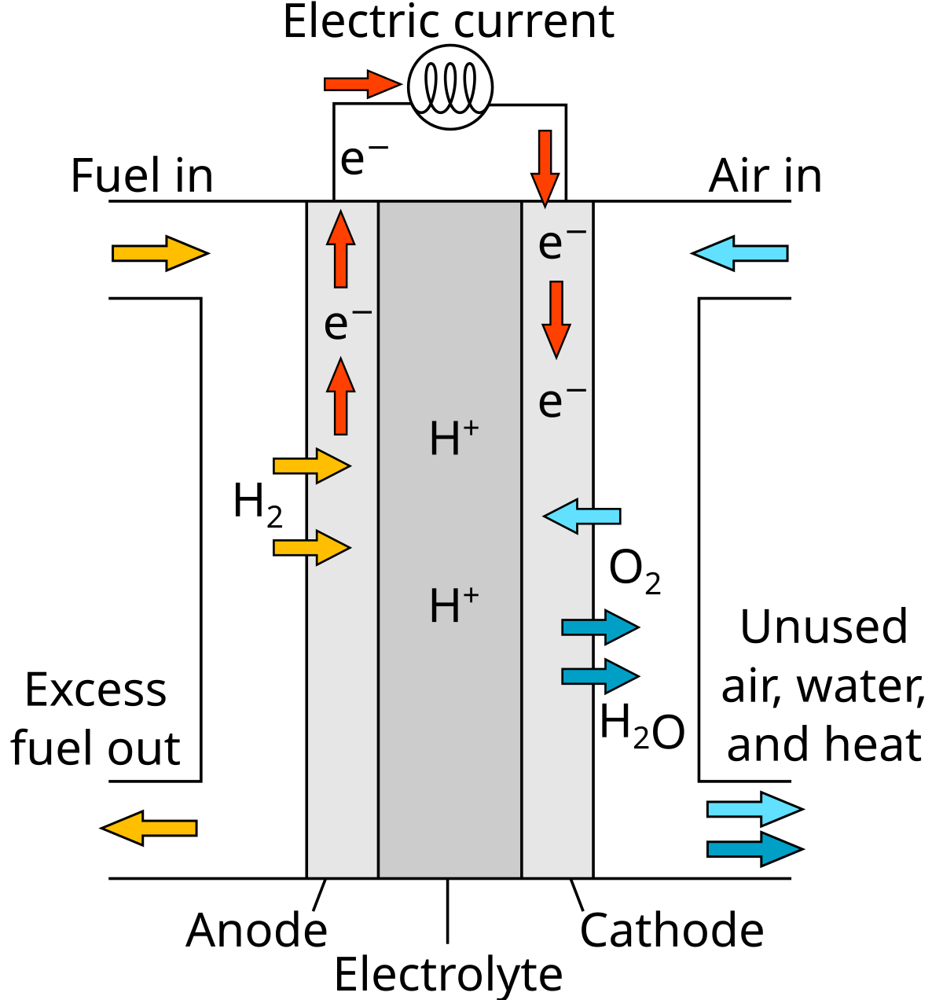

# ⚡ 1D PEM Fuel Cell Simulation Using Finite Difference Methods  
**Capstone Project** of my **Bachelor** in **Mechanical Engineering** at **UC Berkeley**  
**Contributor:** Esteban Labrador  
**Advisors:** Jaime Carpio, Pedro Galán  
**Date:** September 2022 – July 2023  
**Tools Used:** MATLAB, Numerical Modeling, Finite Difference Method  

---

## 🌍 Project Objective  
Hydrogen fuel cells are vital for the clean energy transition, but optimizing their performance requires detailed understanding of complex internal processes. This project develops a **1D Finite Difference Simulation** of a **Proton Exchange Membrane Fuel Cell (PEMFC)** capturing the transport of gases, heat, and electric charge across a multilayer structure including membrane, catalyst layers, diffusion layers, and gas channels.

The model incorporates nonlinear source terms related to electrochemical reactions, making the system highly complex and challenging to solve. The simulation enables analysis of how design parameters and operating conditions impact overall fuel cell efficiency and stability.

  

  <em>Schematic of a proton exchange membrane fuel cell (PEMFC).</em>

---

## ⚙️ Technical Overview  
- **Layers Modeled:** Membrane, catalyst layers, diffusion layers, gas channels (7 layers total)  
- **Equations Solved:** Conservation of mass, momentum, energy, species (H₂, O₂, H₂O, protons), and charge  
- **Numerical Approach:** Finite difference discretization with nonlinear source terms  
- **Challenges:** Strong nonlinearities in species and charge conservation equations requiring iterative solvers for convergence  

---

## 📈 Key Results  
- Detailed profiles of concentration, temperature, potential, and current density across the cell  
- Sensitivity analysis on operating conditions (temperature, pressure, humidity)  
- Validation against literature data (insert link or figure)  

---

## 🖼️ Visualizations  
*(Insert concentration, temperature, electric potential, and current density plots here)*  

---

## 🔄 Next Steps  
- Implement advanced nonlinear solvers to improve convergence speed  
- Extend model to 2D/3D for spatially resolved simulations  
- Integrate with experimental data for model validation  

---

## 🎤 Dissemination  
This work contributes to understanding and optimizing PEM fuel cells for clean energy applications.

---

👉 **View the project on GitHub** _(link placeholder)_
